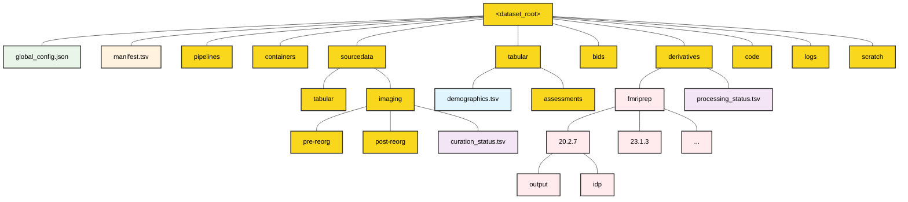

```mermaid
flowchart TD
    A["&lt;dataset_root&gt;"] --- B["global_config.json"]
    A --- C["manifest.tsv"]
    A --- D["pipelines"]
    A --- E["containers"]
    A --- F["sourcedata"]
    A --- G["tabular"]
    A --- H["bids"]
    A --- I["derivatives"]
    A --- J["code"]
    A --- K["logs"]
    A --- L["scratch"]

    F --- M["tabular"]
    F --- N["imaging"]
    N --- O["pre-reorg"]
    N --- P["post-reorg"]
    N --- Q["curation_status.tsv"]

    G --- R["demographics.tsv"]
    G --- S["assessments"]

    I --- T["fmriprep"]
    I --- U["processing_status.tsv"]
    T --- V["20.2.7"]
    V --- W["output"]
    V --- X["idp"]
    T --- Y["23.1.3"]
    T --- Z["..."]

    %% Styling to match original
    classDef directory fill:#f9d71c,stroke:#333,stroke-width:2px,color:#000
    classDef createdFile fill:#fff3e0,stroke:#333,stroke-width:2px,color:#000
    classDef userConfig fill:#e8f5e8,stroke:#333,stroke-width:2px,color:#000
    classDef userTabular fill:#e1f5fe,stroke:#333,stroke-width:2px,color:#000
    classDef tracking fill:#f3e5f5,stroke:#333,stroke-width:2px,color:#000
    classDef derivatives fill:#ffebee,stroke:#333,stroke-width:2px,color:#000

    class A,D,E,F,G,H,I,J,K,L,M,N,O,P,S directory
    class C createdFile
    class B userConfig
    class R userTabular
    class Q,U tracking
    class T,V,W,X,Y,Z derivatives
```
